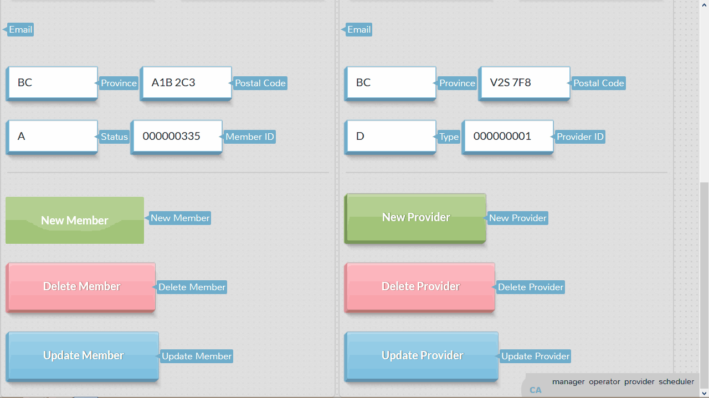
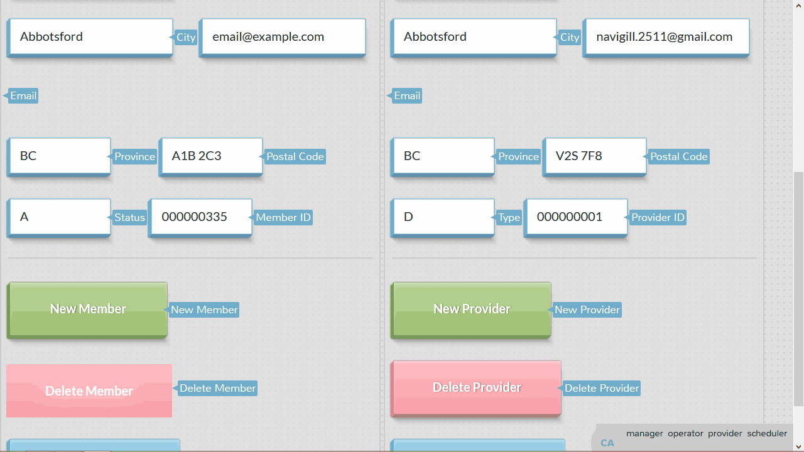

**Chocoholics Anonymous Term Project**
===
Farzin Dhanji, Karanvir Gill &amp; Thomas McLennan

Contents
---
**Solutions**
* [11.24: Requirements Workflow](#1124)
* [12.20: Classical Analysis - Specification Documents](#1220)
* [12.21: Classical Analysis - Software Project Management Plan](#1221)
* [13.22: Object-Oriented Analysis](#1322)
 * [Functional Modeling](#functionalmodeling)
 * [Entity Class Modeling](#entityclassmodeling)
* [14.16: Design](#1416)
 * [Design Decisions](#DesignDecisions)
  * [Mapping of Analysis Classes to Design Classes](#Mapping)
* [15.33: Black-Box Testing](#1533)
* [15.34: Implementation](#1534)

**Commented Code**
* [GitHub](http://github.com/exac/COMP370)

**Screenshots of Sample Runs with Inputs and Outputs**
* [Manager](#ManagerIO)
* [Operator](#OperatorIO)
* [Provider](#ProviderIO)
* [Scheduler](#SchedulerIO)
* [Tests](#TestsIO)

**Contents of Files in which Data is Stored**
* [MySQL Claim Table](#claimtable)
* [MySQL Member Table](#membertable)
* [MySQL Provider Table](#providertable)
* [MySQL Service Table](#servicetable)

**Appendix**
* [Appendix A](#AppendixA)

***
11.24<a name="1124"></a>
===
_Perform the requirements workflow for the Chocoholics Anonymous project in Appendix A_

The overview of the Requirements Workflow includes:

1. Gain an understanding of the application domain or domain.
2. Build a business model.
3. Use the business model to determine the client’s requirements.
4. Iterate the above steps.

The initial glossary for Chocoholics Anonymous:

Business Terms|Descriptions
---|---
Accounts Payable | Amounts of money that ChocAn must pay to providers for services rendered to ChocAn members.
Accounting Procedure |Procedure that is run at midnight each Friday at the ChocAn Data Center. It produces the EFT data and various reports.
Accounting System|An information system to be developed by Acme Accounting Services. This system will be responsible for financial procedures such as recording payments of membership fees, suspending members whose fees are overdue, and reinstating suspended members who have now paid what is owed.
Addiction|An obsession, compulsion or excessive physical or psychological dependence on some substance such as chocolate.
Chocolate|A delicious food made from cacao beans. One of the most popular flavours of the world.
Chocoholics Anonymous. (ChocAn)|An organization dedicated to helping members overcome addiction to chocolate.
ChocAn Data Center|The building where the main computer (server) of ChocAn is housed.
ChocAn Manager| A member of the staff of ChocAn, in a management position, who requires information about the services provided to members during a particular week, as well as the fees to be paid to the providers.
ChocAn Operator| A member of the staff of ChocAn who has the role of maintaining the information about members and providers, i.e. adding a new member or provider, updating details and deleting a member or provider who resigns.
Claim|A request for money due to a provider for a service rendered.
Consultation|An occasion where a provider renders a service to a member of
ChocAn. Dietitian|A health-care professional who compiles a diet tailored for an individual, and monitors his or her progress.
Electronic Funds|A transaction in which an amount of money is transferred from one bank account to another via Transfer (EFT) the internet.
EFT data| Data to be used to transfer funds electronically from the ChocAn bank account to the providers’ bank account.
EFT Component|A component of the ChocAn Information System that will be implemented by a different organization. This component will ensure that each provider’s account is credited with theappropriate amount.
Exercise Specialist|A health-care professional who compiles an exercise routine tailored for an individual, and monitors his or her progress. Internist A health-care professional who is a medical practitioner specializing in the diagnosis, management and non-surgical treatment of illness.
Member|A person who is addicted to chocolate and has joined ChocAn to benefit from the services provided.
Member Number|A 9-digit number that uniquely identifies a ChocAn member.
Member Status|The status of a member may be Active (the member is up to date with payments and entitled to consultations) or Suspended (the member has not paid fees for at least a month and is not entitled to consultations).
Membership Card|A plastic card embossed with the member’s name and number, and incorporating a magnetic strip on which the same information is encoded.
Membership Fee| A monthly amount of money that a member must pay to ChocAn to be entitled to consultations with providers.
Provider|A health-care professional who provides services to ChocAn members. Before providing a service, the provider can verify that the member has a valid membership card, and is not suspended. After providing a service to a member, the provider bills ChocAn by submitting a claim.
Provider Directory|An alphabetically ordered list of service names and corresponding service codes and fees.
Provider Number|A 9-digit number that uniquely identifiesa ChocAn provider.
Provider Terminal|A specifically designed computer terminal, similar to a credit card device in a shop, incorporating a card reader that can read the magnetic strip on a member’s card, a keyboard,and a one-line display.
Provider Type|The type of provider, namely dietician, internist or exercise specialist.
Scheduler|The mechanism that ensures that the accounting procedure is run at set times. The set times are currently midnight on Fridays.
Service|A classification of a treatment, consultation or session with a provider. Example, an aerobic exercise session, a clinical session with a Dietitian, or a consultation session with internist.
Service Code|A 6-digit code that uniquely identifies a service.
Treatment|A synonym for consultation.

**Part 1 of Chocoholics Anonymous use-case Diagram**


**Description of the Apply for Membership use case**

Brief Description: The Apply for membership use case enables a potential member to become a member of Chocoholics  Anonymous|
:--|
Step-by-Step Description:<br>1. The potential member fills in an application form and submits it to Chocoholics Anonymous.<br>2. The staff member responsible for screening applicants decides, using ChocAn business rules whether the potential member should be accepted as a member.<br>3. The staff member informs the potential member of the decision, and if the potential member was accepted, the staff member requests him to pay the monthly fee for the first month.<br> 4. The new member pays the fee for the first month. A ChocAn operator now uses the Maintain Member use case to record the new member’s details and allocate a member number to him.<br>A staff member prints a membership card for the new member and sends the card to him. The new member is now entitled to unlimited consultations and treatments with ChocAn providers.|

**Description of the Make Payment use case**

Brief Description: The Ensure Active Membership use case enables a member to continue to be an active member of Chocoholics Anonymous by paying the monthly fee|
:--|
Step-by-Step Description:<br>1. The member submits the payment of the monthly fee to Chocoholics Anonymous.<br>2. The staff member responsible for payments uses the Accounting System to record the payment and send a receipt to the member.<br>3. The Accounting System updates the member’s status to Active|

**Description of the Join ChocAn use case**

Brief Description: The Join ChocAn use case enables a potential provider to join ChocAn|
:--|
Step-by-Step Description:<br>1.The potential provider submits all required information to ChocAn.<br>2.A staff member responsible for screening providers decides, using ChocAn business rules whether the provider should be accepted as a ChocAn approved provider.<br>3.The staff member informs the potential provider of the decision. A ChocAn operator now uses the Maintain Provider use case to record the new provider’s details and allocate a provider number to him.<br>4.A staff member supplies the provider with a provider terminal and his or her provider number. The new provider may now provide services for ChocAn members and bill ChocAn for those services.|

**Description of the Receive Payment use case**

Brief Description: The Receive Payment use case enables the provider to receive payment for services provided to ChocAn members|
:--|
Step-by-Step Description:<br>1. At the end of each week, the EFT component transfers the money claimed by a provider during that week into the provider’s account.|

Part 2 of Chocoholics Anonymous use-case diagram shows those use cases in which the provider is the primary system actor


**Description of the Manage Session use case**

Brief Description: The Manage Session use case enables the provider to log on to the ChocAn system, use the various functions available to him and be able to log off again.|
:--|
Step-by-Step Description:<br>1. When the provider switches his provider terminal on, the system prompts him to enter his provider number.<br>2. The provider supplies his provider number.<br>3. The system searches for this provider number.<br>4. The system displays the result of the search.<br>&nbsp;&nbsp;&nbsp;&nbsp;4a. If no such provider is found, the system displays an Invalid Number message.<br>&nbsp;&nbsp;&nbsp;&nbsp;4b. If the provider is found, the system displays the options available to the provider. The provider can now use the system as in use cases Verify Member and Receive Provider Directory.<br>5. When the provider chooses the Quit option or switches the terminal off, the system ends the session.|

**Description of the Verify Member use case**

Brief Description: The Verify Member use case enables a provider to verify that a member has a valid member number and that the member is not suspended.|
:--|
Step-by-Step Description:<br>1.The provider swipes the member’s card through the card reader of the provider terminal, or keys in the member number (when the claim is submitted at a later date or time).<br>2. The system searches for a member with this number.<br>3.The system displays the result of the verification.<br>&nbsp;&nbsp;&nbsp;&nbsp;3a. If no such member is found, the system displays an Invalid number message.<br>&nbsp;&nbsp;&nbsp;&nbsp;3b. If the member is found, the system displays a message indicating the status of the member e.g. Suspended if the member is suspended or Validated if the member is active.|

**Description of the Submit Claim use case**

Brief Description: The Submit Claim use case enables a provider to bill Chocoholics Anonymous for a service provided to a member.|
:--|
Step-by-Step Description: After a provider has verified a member, the message Validated appears on the provider’s terminal and the provider can continue to submit a claim.<br>1. The provider enters the date the service was provided in the format MM-DD-YYYY and the service code.<br>2. The system verifies that the service code exists. If it does, the system displays the corresponding service name.<br>3.The provider confirms that this is the correct service rendered.<br>4. The system stores the following information about the claim submitted: &nbsp;&nbsp;&nbsp;&nbsp;Current date and time (MM-DD-YYYY HH:MM:SS)<br>&nbsp;&nbsp;&nbsp;&nbsp;Service date (MM-DD-YYYY)<br>&nbsp;&nbsp;&nbsp;&nbsp;Provider number (max 9 digits)<br>&nbsp;&nbsp;&nbsp;&nbsp;Member number (max 9 digits)<br>&nbsp;&nbsp;&nbsp;&nbsp;Service code (max 6 digits)<br>&nbsp;&nbsp;&nbsp;&nbsp;Comments (max 100 characters)<br>The system displays the fee to be paid to the provider for the service rendered. The provider has a form on which he or she can enter the same information as that stored by the system, as well as the service fee.|

**Description of the Receive Provider Directory  use case**

Brief Description: The Receive Provider Directory use case enables a provider to request and receive a copy of the Provider Directory.|
:--|
Step-by-Step Description:<br>Assumption: The provider must have already switched on his or her terminal and entered his or her provider number correctly.<br>1. The provider submits a request for a Provider Directory through his or her terminal.<br>2. The system generates a list (report) of all services, ordered alphabetically according to the service name,including, for each service:<br>&nbsp;&nbsp;&nbsp;&nbsp;Service name (max 20 characters)<br>&nbsp;&nbsp;&nbsp;&nbsp;Service code (max 6 digits)<br>&nbsp;&nbsp;&nbsp;&nbsp;Service fee (max $999.99)<br>The system sends the list as an email attachment to the provider, and displays a message to this effect on the provider’s terminal.|

Part 3 of Chocoholics Anonymous use-case diagram shows those use cases in which the ChocAn operator is the primary system actor. These use cases include: Maintain Member, Maintain Provider, and Maintain Service.


**Description of the Maintain Member use case**

Brief Description: The Maintain Member use case enables a ChocAn operator to add new members, update the details of existing members and delete members who have resigned.|
:--|
Step-by-Step Description:<br>__A. To add a new member:__ When a potential member’s application for membership has been approved and he or she has paid the first month’s fee, his or her details are forwarded to the ChocAn operator.<br>1. The ChocAn operator selects the option to add a new member, and enters the new member’s details:<br>&nbsp;&nbsp;&nbsp;&nbsp;Member name (max 25 characters)<br>&nbsp;&nbsp;&nbsp;&nbsp;Member street address (max 25 characters)<br>&nbsp;&nbsp;&nbsp;&nbsp;Member city (max 14 characters)<br>&nbsp;&nbsp;&nbsp;&nbsp;Member state (2 letters)<br>&nbsp;&nbsp;&nbsp;&nbsp;Member zip code (5 digits)<br>&nbsp;&nbsp;&nbsp;&nbsp;Member email address (max 50 characters)<br>2. The system allocates a number for the new member, records the new member’s details, and sets the new member’s status to Active.<br>3.The system displays the new member’s number and other details.<br><br>__B. To update an existing member:__<br>When a member’s details have changed, the member submits his or her new details to ChocAn.<br>1.The ChocAn operator finds the existing member details.<br>2.The ChocAn operator edits the details that must be changed. (The member number can never be changed.)<br>3.The system updates the member’s details.<br><br>__C.To delete an existing member:__<br>When a member wants to resign, he or she informs ChocAn.<br>1.The ChocAn operator finds the existing member details.<br>2. The ChocAn operator selects the option to delete the member. <br>The system records the member’s resignation and deletes the member’s details at the end of the week, after the accounting procedure has been run.|

**Description of the Maintain Provider use case**

Brief Description: The Maintain Provider use case enables a ChocAn operator to add new providers, update the details of existing providers and delete providers who have resigned.|
:--|
Step-by-Step Description:<br>__A. To add a new provider:__<br>When a new provider joins ChocAn, his or her details are forwarded to the ChocAn operator. <br>1.The ChocAn operator selects the option to add a new provider, and enters the new provider’s details:<br>&nbsp;&nbsp;&nbsp;&nbsp;Provider name (max 25 characters)<br>&nbsp;&nbsp;&nbsp;&nbsp;Provider street address (max 25 characters)<br>&nbsp;&nbsp;&nbsp;&nbsp;Provider city (max 14 characters)<br>&nbsp;&nbsp;&nbsp;&nbsp;Provider state (2 letters)<br>&nbsp;&nbsp;&nbsp;&nbsp;Provider zip code (5 digits)<br>&nbsp;&nbsp;&nbsp;&nbsp;Provider email address (max 50 characters)<br>2. The system allocates a number for the new provider, records the new provider’s details.<br>3. The system displays the new provider’s provider number and other details.<br>4. The system sends emails to all members informing them of the new provider.<br>__B. To update an existing provider:__ When a provider’s details have changed, the provider submits his or her new details to ChocAn.<br>1. The ChocAn operator finds the existing provider details.<br>2. The ChocAn operator edits the details that must be changed. (The provider number can never be changed.)<br>3.The system updates the provider’s details. The system sends emails to all members informing them of the changes.<br>__C. To delete an existing provider:__<br>When a provider wants to resign, he or she informs ChocAn.<br>1. The ChocAn operator finds the existing provider details.<br>2. The ChocAn operator selects the option to delete the provider. The system records the provider’s resignation and deletes the provider’s details at the end of the week, after the accounting procedure has been run. The system sends emails to all members informing them of the provider’s resignation.|

**Description of the Maintain Service use case**

Brief Description: The Maintain Service use case enables a ChocAn operator to add new Service, update the details of existing Service and delete Service that are discontinued.|
:--|
Step-by-Step Description:<br>The details of new, changed or discontinued services are given to the ChocAn operator by the ChocAn manager.<br>__A. To add a new service:__<br>hen a new provider joins ChocAn, his or her details are forwarded to the ChocAn operator.<br>1. The ChocAn operator selects the option to add a new service, and enters the new services’ details:<br>&nbsp;&nbsp;&nbsp;&nbsp;Service code (max 6 digits)<br>&nbsp;&nbsp;&nbsp;&nbsp;Service name (max 20 characters)<br>&nbsp;&nbsp;&nbsp;&nbsp;Service fee (max $999.99)<br>&nbsp;&nbsp;&nbsp;&nbsp;2. The system records the new service details.<br>&nbsp;&nbsp;&nbsp;&nbsp;3. The system displays the new service details.<br>&nbsp;&nbsp;&nbsp;&nbsp;4.The system sends emails to all providers informing them of the new service.<br>__B. To update an existing service:__<br>1. The ChocAn operator finds the existing service details.<br>2. The ChocAn operator edits the details that must be changed. (The servicenumber can never be changed.)<br>3.The system updates the service details. The system sends emails to all providers informing them of the changes.<br>__C. To delete an existing service:__<br>1. The ChocAn operator finds the existing servicedetails.<br>2. The ChocAn operator selects the option to delete the service. The system records the discontinuation of the service and deletes its details at the end of the week, after the accounting procedure has been run. The system sends emails to all providers informing them of the discontinuation of the service.|

Part 4 of Chocoholics Anonymous use-case diagram shows the use case in which the ChocAn manager is the primary system actor, namely, to request a report, combined with the use case which is initiated by time, namely, the Accounting Procedure that is run at midnight each Friday.


**Description of the Request Report  use case**

Brief Description: The  enables the ChocAn manager to request a member report, a provider report or an accounts payable report.|
:--|
Step-by-Step Description:<br>1. The ChocAn manager selects the report that he or she requires, and enters the end of date of the week he or she requires.<br>2. Type of report being generated:<br>&nbsp;&nbsp;&nbsp;&nbsp;a. For a member report, the manager enters the member number. The system generates a member report using the Produce a Member Report use case.<br>&nbsp;&nbsp;&nbsp;&nbsp;b. For a provider report, the manager enters the provider number. The system generates a provider report using the Produce a Provider Report use case.<br>&nbsp;&nbsp;&nbsp;&nbsp;c. The system generates an accounts payable report using the Produce an Accounts Payable Report use case. <br>&nbsp;&nbsp;&nbsp;&nbsp;3. The manager can choose to print the report. If required, the system prints the report.|

**Description of the Run Accounting Procedure use case**

Brief Description: The Run Accounting Procedure use case enables the Scheduler to run the accounting procedure so that members, providers and the ChocAn manager receive weekly reports. The use case also enables providers to receive the fees due to them by providing the EFT component with the EFT data.|
:--|
Step-by-Step Description:<br>This procedure is run every week at midnight on Friday.<br>1.For each provider, the system generates a report using use case Produce a Provider Report, and sends the report as an email attachment to the provider.<br>2. For each member, the system generates a report using use case Produce a Member Report, and sends the report as an email attachment to the member. <br>3. The system generates an accounts payable report for the ChocAn manager using the use case Produce an Accounts Payable Report, and sends the report to the manager as an email attachment. <br>4. The system produces the EFT data for the EFT component using the use case Produce EFT Data.|

**Description of the Produce Provider Report  use case**

Brief Description: The Produce Provider Report use case enables the system to generate a report of all claims submitted during a specific week by a particular provider.|
:--|
Step-by-Step Description:<br>1. The system generates the provider report including the following information:<br>&nbsp;&nbsp;&nbsp;&nbsp;Provider name (max 25 characters)<br>&nbsp;&nbsp;&nbsp;&nbsp;Provider number (max 9 digits)<br>&nbsp;&nbsp;&nbsp;&nbsp;Provider street address (max 25 characters)<br>&nbsp;&nbsp;&nbsp;&nbsp;Provider city (max 14 characters)<br>&nbsp;&nbsp;&nbsp;&nbsp;Provider state (2 letters)<br>&nbsp;&nbsp;&nbsp;&nbsp;Provider zip code (5 digits)<br>2. For each service provided, the following information, sorted according to claim submission date and time is included:<br>&nbsp;&nbsp;&nbsp;&nbsp;Service date (MM-DD-YYYY)<br>&nbsp;&nbsp;&nbsp;&nbsp;Claim submission date and time (MM-DD-YYYY HH:MM:SS)<br>&nbsp;&nbsp;&nbsp;&nbsp;Member name (max 25 characters)<br>&nbsp;&nbsp;&nbsp;&nbsp;Member number (max 9 digits)<br>&nbsp;&nbsp;&nbsp;&nbsp;Service name (max 20 characters)<br>&nbsp;&nbsp;&nbsp;&nbsp;Service code (max 6 digits)<br>&nbsp;&nbsp;&nbsp;&nbsp;Total number of consultations with members (3 digits)<br>&nbsp;&nbsp;&nbsp;&nbsp;Service fee (max$999.99)<br>&nbsp;&nbsp;&nbsp;&nbsp;Total fee for week (max$99,999.99)|

**Description of the Produce EFT Data use case**

Brief Description: The Produce EFT Data use case enables the system to generate a file containing the current week’s EFT data for the EFT component.|
:--|
Step-by-Step Description:<br>The system writes to a file the following data for each provider who must be paid, for the week:<br>&nbsp;&nbsp;&nbsp;&nbsp;Provider name (max 25 characters)<br>&nbsp;&nbsp;&nbsp;&nbsp;Provider number (max 9 digits)<br>&nbsp;&nbsp;&nbsp;&nbsp;Total fee for week (max $999.99).|

**Description of the Produce Accounts Payable Report use case**

Brief Description: Brief Description: The Produce Accounts Payable Report use case enables the system to generate a summary report of all services rendered by ChocAn providers and the fees due to them during a specific week.|
:--|
Step-by-Step Description:<br>1. The system generates the accounts payable report including the following information:<br>&nbsp;&nbsp;&nbsp;&nbsp;a. For each provider to be paid that week:<br>&nbsp;&nbsp;&nbsp;&nbsp;&nbsp;&nbsp;&nbsp;&nbsp;i. Provider number (max 9 digits)<br>&nbsp;&nbsp;&nbsp;&nbsp;&nbsp;&nbsp;&nbsp;&nbsp;ii. Provider name (max 25 characters)<br>&nbsp;&nbsp;&nbsp;&nbsp;&nbsp;&nbsp;&nbsp;&nbsp;iii. Number of consultations (max 3 digits)<br>&nbsp;&nbsp;&nbsp;&nbsp;&nbsp;&nbsp;&nbsp;&nbsp;iv. Total fee for week (max $999.99)<br>&nbsp;&nbsp;&nbsp;&nbsp;&nbsp;&nbsp;&nbsp;&nbsp;v. Total number of providers who provided services<br>&nbsp;&nbsp;&nbsp;&nbsp;&nbsp;&nbsp;&nbsp;&nbsp;vi. Total number of consultations (max 3 digits)<br>&nbsp;&nbsp;&nbsp;&nbsp;&nbsp;&nbsp;&nbsp;&nbsp;vii. Overall total fee (max $999,999.99).|

**Description of the Produce Member Report use case**

Brief Description: The Produce a Member Report use case enables the system to generate a report of all services rendered to a particular member during a specific week.|
:--|
Step-by-Step Description:<br>1. The system generates the member report including the following information:<br>&nbsp;&nbsp;&nbsp;&nbsp;Member name (max 25 characters)<br>&nbsp;&nbsp;&nbsp;&nbsp;Member number (max 9 digits)<br>&nbsp;&nbsp;&nbsp;&nbsp;Member street address (max 25 characters)<br>&nbsp;&nbsp;&nbsp;&nbsp;Member city (max 14 characters)<br>&nbsp;&nbsp;&nbsp;&nbsp;Member state (2 letters)<br>&nbsp;&nbsp;&nbsp;&nbsp;Member zip code (5 digits)<br>2. For each service provided, the following information sorted according to service date is included:<br>&nbsp;&nbsp;&nbsp;&nbsp;Service date (MM-DD-YYYY)<br>&nbsp;&nbsp;&nbsp;&nbsp;Provider name (max 25 characters)<br>&nbsp;&nbsp;&nbsp;&nbsp;Service name (max 20 characters)|
---

12.20<a name="1220"></a>
===
__Using the technique specified by your instructor, draw up a specification document for the
Chocoholics Anonymous product described in [Appendix A](#AppendixA)__

1. **Draw the data flow diagram**
---
To simplify the data flow diagram, it is drawn in three parts. Data stores and external agents are repeated, but there is only one instance of each process. The data flow diagrams appear in Figures 1.1, 1.2 and 1.3

**Figure 1.1: Part 1 of data flow diagram for Chocoholics Anonymous**


**Figure 1.2: Part 2 of data flow diagram for Chocoholics Anonymous**


**Figure 1.3: Part 3 of data flow diagram for Chocoholics Anonymous**


2. **Decide what sections to computerize, and how.**
---
All processes shown in the Data Flow Diagram ( DFD ) will be computerized. A central database is required, and will be installed on a server at the ChocAn Data Center. Client / Server architecture is required for online implementation of the processes shown in Part 1 of the DFD ( maintenance of the database by a ChocAn operator ) . The processes in Part 2 of the DFD will be implemented using provider terminals that interact with the server via a dial-up modem. The processes shown in Part 3 of the DFD will be implemented firstly as batch processes that will be run at midnight each Friday. This is indicated by the dashed lines ( control flows ) in the DFD. Secondly, a single report can be generated at any time interactively on request by the ChocAn manager from a client workstation

3. **Determine the Details of the Data Flows**
---

**Provider_details:**

* Provider number (max 9 digits) – Generated by system, may not be changed.
* Provider name (max 25 characters)
* Provider street address (max 25 characters)
* Provider city (max 14 characters)
* Provider state (2 letters)
* Provider Zip Code (5 digits)
* Provider email address (max 50 characters)
* Provider type (1 letter) – Dietitian (D), Internist (I) or Exercise Specialist (E)

**Provider_updates:**

* For a new Provider:
 * provider details excluding provider number
* To update an existing provider:
 * Existing provider number
 * Update provider details excluding provider number
* To delete an existing provider:
 * Provider number
* Updated_provider_details:
 * Provider_details

**Member_details:**

* Member number (max 9 digits) – Generated by system, may not be changed.
* Member name (max 25 characters)
* Member street address (max 25 characters)
* Member  city (max 14 characters)
* Member state (2 letters)
* Member Zip Code (5 digits)
* Member email address (max 50 characters)
* Member status (1 letter) – Active (A) or Suspended (S)

**Member_updates:**

* For a new member:
 * member details excluding member number
* To update an existing member:
 * Existing member number
 * Update member details excluding member number
* To delete an existing member:
 * member number
* Updated_member_details:
 * member_details

**Service_Details:**

* Service code (max 6 digits)
* Service name (max 20 characters)
* Service fee (4+2 digits)

**Service_Updates:**

* For a new service:
 * service details
* To update an existing service:
 * Existing service code
 * Update service details
* To delete an existing service:
 * Service code
* Updated_service_details:
 * Service_details

**Claims_Details:**

* Submission data and time (19 characters, format MM-DD-YYY HH:MM:SS)
* Service date (10 characters, format MM-DD-YYYY)
* Provider number (max 9 digits)
* Member number (max 9 digits)
* Service code (max 6 digits)

**Claim_Updates:**

* For a new claim:
* Claim_details
* Verified_provider_number:
 * Provider_number
* Verified_member_number:
 * Member_number
* Verified_service_details:
 * Service_details
* Verified_claim:
 * Claim_details

**Provider_directory:**

* Provider_directory_request (1 character)
* Provider_directory:
 * For each service, alphabetically ordered according to service name:
  * Service name (max 20 characters)
  * Service code (max 6 digits)
  * Service fee (4+2 digits)

**Provider_report_request:**

* Provider number (max 9 digits)
* End date of week (10 characters, format MM-DD-YYYY)
* Provider_report:*
 * Provider name (max 25 characters)
 * Provider street address (max 25 characters)
 * Provider city (max 14 characters)
 * Provider state (2 letters)
 * Provider Zip Code (5 digits)
 * For each service provided, sorted according to claim submission Date and time:
  * Service date (10 characters, format MM-DD-YYYY)
  * Submission date and time (19 characters, format MM-DD-YYY HH:MM:SS)
  * Member name (max 25 characters)
  * Member number (max 9 digits)
  * Service code (max 6 digits)
  * Service fee (4+2 digits)
  * Total number of consultations (3 digits)
  * Total fee for week (5+2 digits)

**Member_report_request:**
* Member number (max 9 digits)
* End date of week (10 characters, format MM-DD-YYYY)
* Member_report:
 * Member name (max 25 characters)
 * Member number (max 9 digits)
 * Member street address (max 25 characters)
 * Member  city (max 14 characters)
 * Member state (2 letters)
 * Member Zip Code (5 digits)
 * For each service provided, sorted according to service date:
  * Service date (10 characters, format MM-DD-YYYY)
  * Provider name (max 25 characters)
  * Service name (max 20 characters)

**Accounts_payable_report:**
* For each provider to be paid that week:
 * Provider name (max 25 characters)
 * Number of consultations (max 3 digits)
 * Total fee (5+2 digits)
 * Total number of providers
 * Overall total fee (6+2 digits)
 * EFT_data for each provider to be paid:
 * Provider name (max 25 characters)
 * Provider number (max 9 digits)
 * Total fee for week (5+2 digits)

4: Define Logic of Processes
---
**Maintain provider**
 *To add a new provider:*
  * Insert the provider details excluding provider number into the database.
  * The database must generate a provider number for the new provider.
 * To update an existing provider:
  * Search for the existing provider using the provider number.
  * Update the provider details.
 * To delete an existing provider:
  * Search for the existing provider using the provider number.
 * Delete the provider details.

**Maintain member**
 * To add a new member:
  * Insert the member details excluding member number into the database.
  * The database must generate a member number for the new member.
 * To update an existing member:
  * Search for the existing member using the member number.
  * Update the member details.
 * To delete an existing member:
  * Search for the existing member using the member number.
  * Delete the member details.

**Maintain Service**
 * To add a new service:
  * Insert the service details into the database.
 * To update an existing service:
  * Search for the existing service using the service code.
  * Update the service details.
 * To delete an existing service:
  * Search for the existing service using the service code.
  * Delete the service details.

**Verify Provider**
 * Search for the provider number in the database.

**Verify Member**
 * Search for the member number in the database.
 * Determine if the member status is Active.

**Process Claim**
 * Search for the service code in the database.
 * Insert the verified claim into the database.

**Generate Provider Directory**
 * Extract provider directory data from the database.

**Generate EFT data**
 * Extract EFT data from the database.

**Generate Provider Report**
 * Extract provider report data from the database.

**Generate Member Report**
 * Extract member report data from the database.

**Generate Accounts Payable Report**
 * Extract accounts payable report data from the database.

5: Define the data stores
---
* PROVIDERS DATA
  * Provider details – defined in step 3.

* MEMBERS DATA
  * Member details – defined in step 3.

* SERVICES DATA
  * Service details – defined in step 3.

* CLAIMS DATA
  * Claim details – defined in step 3.

6: Define physical resources.
---
Use a relational database with a separate table for each of the data stores defined above.
* PROVIDER TABLE
 * Primary key: provider_number
* MEMBER TABLE
 * Primary key: member_number
* SERVICE TABLE:
 * Primary key: service_code
 * Secondary index: service_name
* CLAIM TABLE:
 * Primary key: submission_date_and_time
 * Foreign Key: provider_number
 * Foreign Key: member_number
 * Foreign Key: service_code
 * Secondary index: service_date

7: Determine input/output specifications
---
The content of input screens and reports and the format of fields have been determined in step 3. Input screens will be designed for the following processes:
(ChocAn operator interface)
 * maintain provider
 * maintain member
 * maintain service
(ChocAn manager interface)

 * generate provider report
 * generate member report
 * generate accounts payable report

A web - based interface (user dialogue for the provider terminal) will be designed for the following processes:
 * verify provider (when the terminal is switched on)
 * verify member
 * process claim
 * request provider directory

The layout of the following reports will be designed:
 * provider report
 * member report
 * accounts payable report
 * provider directory

The exact format of the EFT data must be determined for the following process:
 * generate EFT data

8: Perform Sizing
---
Database:
 * Provider table: approximately 124 to 132 bytes for each record. ChocAn has about 100 providers currently and expects a growth of 10%. Thus the provider table needs approximately 15 Kilobytes of storage.
 * Member table: record sizes are equivalent to provider records. ChocAn has about 1000 members currently and expects a growth of 20%. Thus the member table needs approximately 160 Kilobytes of storage.
 * Service table: approximately 32 types for each record. There are currently 50 different services available. Making provision for a growth of 25%, approximately 2 Kilobytes of storage are required.
 * Claim table: approximately 52 bytes for each record. On average, each member visits a provider twice a week. The expected number of claims per year is thus 124800. Approximately 7 Megabytes are required for the claim table. Software:
 * A Database Management System (DBMS) can require 10 to 500 MB, or more, of storage.
 * The application programs that must run on the server will require approximately 2 MB of storage. Middleware is also necessary so that the server and clients can interact. This will also require a few megabytes of storage.
 * Assuming a DBMS of approximately 75 MB, 100 MB of storage on the server should be sufficient. Client workstations need only enough storage to run the interface programs. This will be only a few megabytes. Provider terminals will need at least 10 MB of storage space because the software will include a web-based graphical user interface.

9: Determine the Hardware Requirements
---
One server will be required for the database. At least two terminals are needed for ChocAn operator for the maintenance of data, and at least one more is needed for the manager to un reports. At least one printer will be needed for the manager to print reports. Each provider will need a provider terminal. It is assumed that each provider will use his own computer to receive email, including provider reports and the provider directory.


13.22<a name="1322"></a>
===
_Perform the analysis workflow of the Chocoholics Anonymous product described in Appendix A._

Assumptions:
* If a provider resigns, the information about him cannot be deleted from the system before all his claims have been processed.
* Similarly, the information about a member or a service cannot be deleted until all claims concerning the member or service have been processed. Thus such deletions should be delayed until the end of the week. This requirement has been ignored in the analysis workflow since the timing of actions is not a concern of analysis.
* A “nice to have” requirement is that members should be informed of new providers, resignation of providers and changed provider details.
* Similarly, providers should be informed of new services, discontinuation of services and changed service details. The requirements workflow includes sending such information by email to the providers and members. This has been left out of the analysis workflow since it is not essential to the product.

Functional Modeling<a name="functionalmodeling"></a>
---
Scenarios for the use cases of Chocoholics Anonymous depicted in Problem 11.24 Part 1 to 4 appear below the in following use cases descriptions.

Figure 1.0: An extended scenario for the Manage Session use case|
---|
A provider wishes to initiate a session to use the ChocAn system to verify members, submit claims and receive a provider directory. The provider switches on his or her terminal.<br><br>1. The system prompts the provider for his or her provider number.<br>2. The provider supplies his or her provider number.<br>3. The system searches for a provider with this number.<br>4. The system displays a message indicating the options available to the provider.<br>5. The provider can now use the system.<br>6. When the provider has finished used the system, he or she chooses the Quit option.<br>7. The system ends the session.|
**Possible Alternative** <br> A. In step 3, the system cannot find the provider number. The system displays the message invalid number, and step 1 is repeated.|

Figure 1.1: An extended scenario for the Verify Member use case|
--|
A provider wishes to verify that the number on a member’s card is a valid ChocAn membership number of an active member. The provider has switched on his or her terminal and entered his or her provider number correctly.<br>1. The provider swipes the member’s card through the card reader of the provider terminal.<br>2. The system searches for a member with this number.<br>3. The system displays a message indicating the status of the member on the provider terminal’s display, namely, Validated. |
**Possible Alternative** <br>A. In step 2, the system cannot find the member number. The system displays the message invalid number, and the use case terminates.<br>B. In step 3, the member’s status is “suspended”. The system displays the message Suspended, and the use case terminates.|

Figure 1.2: An extended scenario for the Submit Claim use case|
---|
A provider wishes to submit a claim for a service provided to a ChocAn member. He or she has already verified the member as in the normal scenario of the Verify Member use case.<br>1. The provider enters the date the service was provided in the format MM-DD-YYYY, the service code and optionally comments about the service rendered.<br>2. The system verifies that the service code exists. The system displays the corresponding service name.<br>3. The provider confirms that this is the correct service rendered.<br>4. The system stores the following information about the claim submitted:<br>&nbsp;&nbsp;&nbsp;&nbsp;Current date and time (MM-DD-YYYY HH:MM:SS)<br>&nbsp;&nbsp;&nbsp;&nbsp;Service date (MM-DD-YYYY)<br>&nbsp;&nbsp;&nbsp;&nbsp;Provider number (max 9 digits)<br>&nbsp;&nbsp;&nbsp;&nbsp;Member number (max 9 digits)<br>&nbsp;&nbsp;&nbsp;&nbsp;Service code (max 6 digits)<br>5. The system displays the fee to be paid to the provider for the service rendered.<br>6. The provider has a form on which he or she can enter the same information as that stored by the system, as well as the service fee. |
**Possible Alternative** <br>A. In step 2, the service code does not exist. The system displays the message Invalid Service code. The provider re-enters the service code and step 2 is repeated.<br>B. In step 3, the service name is not the name of the service for which the provider wishes to submit a claim. The provider re-enters the service code and step 2 is repeated.|

Figure 1.3: Scenario for the Receive Provider Directory use case|
--|
A provider has already switched on his or her terminal and entered his or her provider number correctly.<br>1. The provider submits a request for a Provider Directory through his or her terminal.<br>2. The system generates a list (report) of all services, ordered alphabetically according to the service name, including each service:<br>Service name(max 20 characters)<br>Service code(max 6 digits)<br>Service fee (max $999.99)<br>3. The system sends the list as an email attachment to the provider, and displays a message to this effect on the provider’s terminal.|

Figure 1.4: First extended scenario of the Maintain Member use case (add a new member) A ChocAn operator wishes to add a new member.|
---|
1. The ChocAn operator selects the option to add a new member, and enters the new member’s details:<br>Member name (max 25 characters)<br>Member street address (max 25 characters)<br>Member city (max 14 characters)<br>Member state (2 letters)<br>Member zip code (5 digits)<br>Member email address (max 50 characters)<br>2. The system allocates a number to the new member, records the new member’s details, and sets the new member’s status to Active. <br>3. The system displays the new member’s member number and other details.|

Figure 1.5:Second extended scenario of the Maintain Member use case (update an existing member) |
---|
A ChocAn operator wishes to update an existing member’s details.<br>1. The ChocAn operator enters the existing member’s member number.<br>2. The system searches for the details for the member and displays the details.<br>3. The ChocAn operator edits the details that must be changed. (The member number can never be changed.)<br>4. The system updates the member’s details.|
**Possible Alternative** <br>A. In step 2, the system cannot find the member number. It displays the message invalid number, and the use case terminates.|


Figure 1.6: Third extended scenario of the Maintain Member use case (delete an existing member)|
---|
A ChocAn operator wishes to delete an existing member.<br>1. The ChocAn operator enters the existing member’s member number.<br>2. The system searches for the details for the member and displays the details.<br>3. The ChocAn operator selects the option to delete the member.<br>4. The system deletes the member’s details.|
**Possible Alternative**<br>&nbsp;&nbsp;&nbsp;&nbsp;A. In step 2, the system cannot find the member number. It displays the message invalid number, and the use case terminates.|

Figure 1.7: First extended scenario for the Maintain Provider use case (add a new provider)|
---|
A ChocAn operator wishes to add a new provider.<br>&nbsp;&nbsp;&nbsp;&nbsp;1. The ChocAn operator selects the option to add a new provider, and enters the new provider’s details:<br>&nbsp;&nbsp;&nbsp;&nbsp;Provider name (max 25 characters)<br>&nbsp;&nbsp;&nbsp;&nbsp;Provider street address (max 25 characters)<br>&nbsp;&nbsp;&nbsp;&nbsp;Provider city (max 14 characters)<br>&nbsp;&nbsp;&nbsp;&nbsp;Provider state (2 letters)<br>&nbsp;&nbsp;&nbsp;&nbsp;Provider zip code (5 digits)<br>&nbsp;&nbsp;&nbsp;&nbsp;Provider email address (max 50 characters)<br>&nbsp;&nbsp;&nbsp;&nbsp;Provider type (Dietitian, Internist, or Exercise Specialist)<br>2. The system allocates a number to the new provider and records the new provider<br>’s details.<br>3. The system displays the new provider’s number and other details.|

Figure 1.8: Second scenario for the Maintain Provider use case (update an existing provider)|
---|
A ChocAn operator wishes to update an existing provider’s details. <br>1. The ChocAn operator enters the existing provider’s provider number.<br>2. The system searches for the details for the provider and displays the details.<br>3. The ChocAn operator edits the details that must be changed. (The provider number can never be changed.)<br>4. The system updates the provider’s details.|
**Possible Alternative**<br>&nbsp;&nbsp;&nbsp;&nbsp;A. In step 2, the system cannot find the provider number. It displays an error message, and the use case terminates.|

Figure 1.9: Third extended scenario of the Maintain Provider use case (delete an existing provider)|
---|
A ChocAn operator wishes to delete an existing provider.<br>1. The ChocAn operator enters the existing provider’s provider number.<br>2. The system searches for the details for the provider and displays the details.<br>3. The ChocAn operator selects the option to delete the provider.<br>4. The system deletes the provider’s details.|
**Possible Alternative**<br>&nbsp;&nbsp;&nbsp;&nbsp;A. In step 2, the system cannot find the member number. It displays an error message, and the use case terminated.|

Figure 1.10: First extended scenario for the Maintain Service use case (add a service)|
---|
A ChocAn operator wishes to add a new service. <br>1.The ChocAn operator selects the option to add a new service, and enters the new service’s details:<br>&nbsp;&nbsp;&nbsp;&nbsp;Service name  (max 20 characters)<br>&nbsp;&nbsp;&nbsp;&nbsp;Service code (max 6 digits)<br>&nbsp;&nbsp;&nbsp;&nbsp;Service fee (max $999.99)<br>&nbsp;&nbsp;&nbsp;&nbsp;2. The system records the new service details.<br>3. The system displays the new service details.|

Figure 1.11: Second extended scenario for the Maintain Service use case (update a service)|
---|
A ChocAn operator wishes to update an existing service.<br>1. The ChocAn operator enters the existing service code.<br>2. The system searches for the details for the service and displays the details.<br>3. The ChocAn operator edits the details that must be changed.<br>4. The system updates the service details.|
**Possible Alternative**<br>A. In step 2, the system cannot find the service code. It displays an error message, and the use case is terminated.|

Figure 1.12: Third extended scenario for the Maintain Service use case (delete a service)|
---|
A ChocAn operator wishes to delete an existing service. <br>1. The ChocAn operator enters the existing service code.<br>2. The system searches for the details for the service and displays the details.<br>3. The ChocAn operator selects the option to delete the service.<br>4. The system deletes the service details.|
**Possible Alternative**<br>A. In step 2, the system cannot find the service code. It displays an error message, and the use case is terminated.|

Figure 1.13:|
---|
First extended scenario for the Request Report use case (provider report) The ChocAn manager wishes to print provider report.<br>1. The ChocAn manager selects the provider report, and enters the end date of the week he or she requires and the provider number.<br>2. The system generates a provider report including the following information:<br>&nbsp;&nbsp;&nbsp;&nbsp;Provider name (max 25 characters)<br>&nbsp;&nbsp;&nbsp;&nbsp;Provider number (max 9 digits)<br>&nbsp;&nbsp;&nbsp;&nbsp;Provider street address (max 25 characters)<br>&nbsp;&nbsp;&nbsp;&nbsp;Provider city (max 14 characters)<br>&nbsp;&nbsp;&nbsp;&nbsp;Provider province (2 letters)<br>&nbsp;&nbsp;&nbsp;&nbsp;Provider zip code (5 digits)<br>&nbsp;&nbsp;&nbsp;For each service provided, the following information, sorted according to claim submission date and time, is included:<br>&nbsp;&nbsp;&nbsp;&nbsp;Service date (MM-DD-YYYY)<br>&nbsp;&nbsp;&nbsp;&nbsp;Claim submission date and time (MM-DD-YYYY HH:MM:SS)<br>&nbsp;&nbsp;&nbsp;&nbsp;Member name(max 25 characters) <br>&nbsp;&nbsp;&nbsp;&nbsp;Member number (max 9 digits)<br>&nbsp;&nbsp;&nbsp;&nbsp;Service code (max 6 digits)&nbsp;&nbsp;&nbsp;&nbsp;Service fee (max $999.99)<br>&nbsp;&nbsp;&nbsp;&nbsp;Total number of consultations with members (3 digits) <br>&nbsp;&nbsp;&nbsp;&nbsp;Total fee for week (max $99,999.99)<br>3. The manager chooses to print the report.<br>4. The system prints the report.|
**Possible Alternatives** A. In step 1, the ChocAn manager enters an invalid provider number. The system displays an error message and the use case terminates.<br>B. In step 3, the ChocAn manager chooses not to print the report. The use case terminates.|

Figure 1.14: Second extended scenario for the Request Report use case (member report)|
--|
A ChocAn manager wishes to print a member report.<br>1. The ChocAn manager selects the member report, and enters the end date of the week he or she requires and the member number.<br>2. The system generates a member report including the following information:<br>&nbsp;&nbsp;&nbsp;&nbsp;Member name (max 25 characters)<br>&nbsp;&nbsp;&nbsp;&nbsp;Member number (max 9 digits)<br>&nbsp;&nbsp;&nbsp;&nbsp;Member street address (max 25 characters)<br>&nbsp;&nbsp;&nbsp;&nbsp;Member city (max 14 characters)<br>&nbsp;&nbsp;&nbsp;&nbsp;Member state (2 letters)<br>&nbsp;&nbsp;&nbsp;&nbsp;Member zip code (5 digits)<br>&nbsp;&nbsp;&nbsp;For each service provided, the following information, sorted according to service date, is included:<br>&nbsp;&nbsp;&nbsp;&nbsp;Service date (MM-DD-YYYY)<br>&nbsp;&nbsp;&nbsp;&nbsp;Provider name (max 25 characters)<br>&nbsp;&nbsp;&nbsp;&nbsp;Service name  (max 20 characters)<br>3. The manager chooses to print the report.<br>4. The system prints the report. |
**Possible Alternatives**<br>A. In step 1, the ChocAn manager enters an invalid member number. The system displays an error message and the use case terminates.<br>B. In step 3, the ChocAn manager chooses not to print the report. The use case terminates.|

Figure 1.15: Third extended scenario for the Request Report use case (accounts payable report)|
---|
The ChocAn manager wishes to print an accounts payable report.<br>1. The ChocAn manager selects the accounts payable report, and enters the end date of the week he or she requires.<br>2. The system generates an accounts payable report including the following information:<br>&nbsp;&nbsp;&nbsp;For each provider to be paid that week:<br>&nbsp;&nbsp;&nbsp;&nbsp;&nbsp;&nbsp;Provider name (25 characters)<br>&nbsp;&nbsp;&nbsp;&nbsp;&nbsp;&nbsp;Number of consultations (max 6 digits)<br>&nbsp;&nbsp;&nbsp;&nbsp;&nbsp;&nbsp;Total fee (max $99,999.99)<br>&nbsp;&nbsp;&nbsp;Total number of providers who provided services (max 6 digits)<br>&nbsp;&nbsp;&nbsp;Total number of consultations (max 9 digits)<br>&nbsp;&nbsp;&nbsp;Overall total fee (max $99,999.99)<br>3. The manager chooses to print the report.|
**Possible Alternative**<br>A. In step 3, the ChocAn manager chooses not to print the report. The use case terminates.|

Figure 1.16: Scenario for the Run Accounting Procedure use case|
--|
The accounting procedure is run every week at midnight on Friday.<br>1. For each provider, the system generates a provider report (First extended scenario for the Request a Report use case–provider report) and sends the report as an email attachment to the provider.<br>2. For each member, the system generates a member report (Second extended scenario for the Request a Report use case–member report), and sends the report as an email attachment to the member.<br>3. The system generates an accounts payable report for the ChocAn manager (Third extended scenario for the Request a Report use case–accounts payable report), and sends the report to the manager as an email attachment.<br>4. The system generates the following EFT data for each provider who must be paid for the week:<br>&nbsp;&nbsp;&nbsp;&nbsp;Provider name (max 25 characters)<br>&nbsp;&nbsp;&nbsp;&nbsp;Provider number (max 9 digits)<br>&nbsp;&nbsp;&nbsp;&nbsp;Total fee for week (max $99,999.99)|

Entity Class Modeling<a name="entityclassmodeling"></a>
---

Candidate entity classes are determined using noun extraction.


__Description of software product in a single paragraph__:
The ChocAn system allows providers to verify a person’s ChocAn
membership status, and to submit a claim for a service provided to an active member. The data required by the system can be
maintained by a ChocAn operator. The ChocAn manager can request various reports.
Identify the nouns/noun phrases:
The ChocAn system
allows providers to verify a person’s ChocAn membership status, and to
submit a claim for a service provided to an active member. The data required by the system can be maintained by a ChocAn
operator. The ChocAn manager can request various reports.
With
regard to the nouns in the previous paragraph:
* ChocAn System: the software product itself
* Provider: possible entity class
* Person: can be a provider, member, operator or manager.
* Membership status: possible attribute of member
* Claim: possible entity class
* Service: possible entity class
* Data: describes all attributes of entity classes
* ChocAn operator: actor, no information needs to be stored about this actor
* ChocAn manager: actor, no information needs to be stored about this actor

**Figure 1.17: The entity class diagram of the Chocoholics Anonymous product**


<table>
  <tbody>
    <tr>
      <td>
        **Control Classes**
        <ul>
          <li>ChocAn System</li>
          <li>Claim Submitter</li>
          <li>Member Maintainer</li>
          <li>Provider Maintainer</li>
          <li>Service Maintainer</li>
          <li>Provider Directory Generator</li>
          <li>Provider Report Generator</li>
          <li>Member Report</li>
          <li>Generator</li>
          <li>Accounts Payable Report Generator</li>
          <li>EFT Report Generator</li>
        </ul>
      </td>
      <td>
        **Boundary Classes:**
        <ul>
          <li>Provider Interface
          <li>Manager Interface</li>
          <li>Operator Interface</li>
          <li>Scheduler Interface</li>
          <li>Provider Directory</li>
          <li>Provider Report</li>
          <li>Member Report</li>
          <li>Accounts Payable Report</li>
          <li>EFT Data Report</li>
        </ul>
      </td>
    </tr>
  </tbody>
</table>

Dynamic Modeling<a name="dynamicmodeling"></a>
---
Statecharts for the ChocAn product are shown in Parts I, II, III and IV.

**Figure
1.18: The statechart for the Chocoholics Anonymous product**


**Figure 1.19: The Provider subsystem statechart**


**Figure 1.20: Maintenance subsystem statechart**

**Figure 1.21: Reporting subsystem statechart**

We now realize the use cases.

***Use case Manage Session:***

**Figure 1.22: Class diagram showing the classes that realize the Manage Session use case of the ChocAn software product**


**Figure 1.23: Collaboration diagram of the realization of the scenario of the Manage Session use case of the ChocAn software product**


**Figure 1.24: The flow of events of the realization of the scenario of the Manage Session use case of the ChocAn software product**


**Figure 1.25: A Sequence diagram equivalent to the collaboration diagram from Part VI of the Manage Session use case scenario**


***Use Case Verify Member***

**Figure 1.26: Class diagram showing the classes that realize the Verify Member use case of the ChocAn software product**


**Figure 1.27: Collaboration diagram of the realization of the scenario of the Verify Member use case of the ChocAn software product**


**Figure 1.28: The flow of events of the realization of the scenario of the Manage Session use case of the ChocAn software product**


**Figure 1.29: Sequence diagram equivalent to the collaboration diagram for Verify Member use case**


***Use case Submit Claim:***
**Figure 1.30: Collaboration diagram showing the classes that realize the Submit Claim use case (Figure 1.20) of the ChocAn software product**


**Figure 1.31: Collaboration diagram of the realization of the scenario of Figure 1.2 for Submit Claim use case of the ChocAn software product.**


**Figure 1.32: The flow of events of the realization of the scenario of Figure 1.2 for Submit Claim use case of the ChocAn software product.**


**Figure 1.33: A Sequence diagram equivalent to the collaboration diagram of Figure 1.31. The flow of events of the realization of the scenario of Figure 1.32 for Submit Claim use case of the ChocAn software product.**


**Figure 1.34: Class diagram showing the classes that realize the Receive Provider Directory use case (Figure 1.3)**


**Figure 1.35: Communication diagram of the realization of the scenario of Figure 1.3 of the Receive Provider Directory use case of the ChocAn software product.**


**Figure 1.36: The flow of events of the realization of the scenario of Figure 1.3 of the Receive Provider Directory use case of the ChocAn software product.**


**Figure 1.37: Sequence diagram equivalent to the Collaboration diagram of Figure 1.35. The flow of events is shown in Figure 1.36.**


***Use case Maintain Member:***
Consider the add new member scenario of Figure 1.4. The Collaboration diagram is shown in Figure 1.39, the flow of events diagram in Figure 1.40 and the corresponding sequence diagram in Figure 1.41.
**Figure 1.38: Class diagram showing the classes that realize the Maintain Member use case – add new member (Figure 1.4) of the ChocAn software product**


**Figure 1.39: Collaboration diagram of the realization of the Add a Member scenario of Figure 1.4 of the Maintain Member use case of the ChocAn software product.**


14.16<a name="1416"></a>
===

14.16<a name="1416"></a>
===
_Starting with your specifications of Problem [12.20](#1220) or [13.22](#1322), design the Chocoholics Anonymous product (Appendix A). Use the 9-step process._
Design Descisions<a name="DesignDecisions"></a>
---
1.	An HTML GUI will be used to create the provider, operator & manager interface.
2.	Reports will be saved as html files.
3.	ETF data will be saved to html files.
4.	The system will be implemented in three parts:
a.	A server running Apache2 (object-oriented PHP)
b.	A server running a MySql database holding the claim, member, provider and, service tables.
c.	An arbitrary computing device to connect to the web server.
5.	The operator interface allows updating of a member’s data.
6.	The accounting (Scheduler) can be run manually, or with a cron job every Friday.
7.	Persistent class data is stored in the database, and accessed on run.
8.	Relationships between entity classes (Claim, Service, Provider and, Member) are implemented by identifying indexes stored in the database.
9.	The server-side code will be implemented in PHP and shell scripts. The client-side code will run JavaScript. The database server is MySql.

Mapping of Analysis Classes to Design Classes<a name="Mapping"></a>
---
Analysis classes map to design classes.

The **ChocAnSystem** class creates the provider (terminal?), operator and, manager interfaces.

The **UserInterface** class handles the four user interfaces (**ProviderInterface**, **OperatorInterface**, **ManagerInterface** and, **SchedulerInterface**. They are used for all output.

The entity classes have their information stored in the database. Each entry holds the data for one entity class (**Members**, **Providers**, **Persons**, **Services** and **Claims**).
**ProviderMaintainer** and **MemberMaintainer** inherit **PersonMaintainer**.

**Report** is the superclass behind all the report classes. **DateRangeReport** is a subclass of report that limits the date-range of reports.

**MemberReportGenerator** saves all reports.

15.33<a name="1533"></a>
===
_Draw up black-box test cases for the product you specified in Problem [12.20](#1220) or [13.22](#1322). For each test case, state what is being tested and the expected outcome of that test case.
Black-Box Tests_
The functions outlined in the specifications document are outlined in the test cases:

Black-Box Test Cases
---
**Database**

Equivalence classes for *Database password*.

Password | Result
--- | ---
Password is string | true
Password's first character is alphanumeric | true
Password < 1 character | true

Database.member_number | Result|
--- | ---
member_number is created | true
member_number cannot be set as "0" | acceptable
member_number can be "1" | true
member_number can be "999999999" | true
member_number cannot be "1000000000" | acceptable
member_number cannot be "a" | acceptable
member_number cannot be "" | acceptable

Database.member_name | Result|
--- | ---
member_name is created | true
member_name can be "m" | true
member_name can be "1" | true
member_name can be "xxxx xxxx xxxx xxxx xxxx" | true
member_name cannot be "xxxx xxxx xxxx xxxx xxxx xxxx" | true
member_name cannot be "" | acceptable

... Repeated for member_street_address, member_city, member_postal_code, member_email_address.

Database.member_province | Result|
--- | ---
member_name is created | true
member_name can be "BC" | true
member_name cannot be "British Columbia" | acceptable
member_name cannot be "CB" | acceptable
member_name cannot be "C-B" | acceptable
member_name cannot be "B.C." | acceptable
member_name cannot be "NWT" | acceptable
member_name cannot be "CB" | acceptable

We are testing the following:

```php
if ($this->getLength($province) > self::PROVINCE_LENGTH) //p<2
{
	$province = strtoupper($province);

	if ($province[0] === "A") $province = "AB";
	if ($province[0] === "B") $province = "BC";
	if ($province[0] === "C") $province = "BC";
	if ($province[0] === "M") $province = "MB";
	if ($province[0] === "N" && strpos($province, 'B' !== false)) $province = "NB";
	if ($province[0] === "N" && strpos($province, 'L' !== false)) $province = "NL";
	if ($province[0] === "N" && strpos($province, 'U') !== false) $province = "NU";
	if ($province[0] === "N" && $this->getLength($province) > self::PROVINCE_LENGTH) $province = "NS";
	if ($province[0] === "N" && strpos($province, 'T' !== false)) $province = "NT";
	if ($province[0] === "O") $province = "ON";
	if ($province[0] === "C") $province = "QC";
	if ($province[0] === "S") $province = "SK";
	if ($province[0] === "Y") $province = "YT";
}
```

Database.member_status | Result|
--- | ---
member_name is created | true
member_name can be "A" | true
member_name can be "S" | true
member_name cannot be "Suspended" | acceptable
member_name cannot be "Active" | acceptable
member_name cannot be "a" | acceptable
member_name cannot be "s" | acceptable
member_name cannot be "0" | true
member_name cannot be "null" | true

This is repeated for Provider, except provider_status is tested as follows:

Database.provider_type | Result|
--- | ---
provider_type is created | true
provider_type can be "I" | true
provider_type can be "E" | true
provider_type can be "D" | true
provider_type cannot be "Dietitian" | acceptable
provider_type cannot be "Internist" | acceptable
provider_type cannot be "Exercise Expert" | acceptable
provider_type cannot be "" | true
provider_type cannot be "0" | true
provider_type cannot be "null" | true

In both cases above, if the first letter of the string matches an acceptable value, it is chosen.

**Other Database Tests**

Test | Result|
--- | ---
Test if database accepts login | true
Test if 'claim' database is working | acceptable
Asserts the member database table is working. | true
Asserts the provider database table is working. | true
Asserts the service database table is working. | true
Test unique keys (run on claim timestamp key) | acceptable
Test unique keys (run on member key) | acceptable
Test unique keys (run on provider key) | acceptable
Test unique keys (run on service key) | acceptable

**General tests**

Test | Result|
--- | ---
Asserts SERVER[REMOTE_ADDR] is set,<br> it's needed for testing and Database connectivity. | true
Test PHP's MySQLi plugin loads. | true
Checks if mysqli exists (but potentially hasn't been started) | true
Test that the calculation in private function Person()->getLength() is correct | true

**Member Tests**

Member Test | Result|
--- | ---
Create a member that already exists | acceptable
Asserts members can be found in the database. | true
Asserts postal codes are in correct Canadian format. | true

**Provider Tests**

Provider Test | Result|
--- | ---
Asserts postal codes are in correct Canadian format. | true

**Person Tests**

Person Test | Result|
--- | ---
Checks if getting all members works.<br>Also stress-tests mysql with a lot of queries at once. | acceptable
Checks if getting all providers works.<br>Also stress-tests mysql with a lot of queries at once. | acceptable
Asserts that a database entry will be created for dummy example member. | true

Functional Analysis Test Cases
---
1.  Manage Session
2.	Verify Member
3.	Submit Claim
4.	Receive Order
5.	Receive Provider Directory
6.	Maintain Member (Add a new member)
7.	Maintain Member (Update existing member)
8.	Maintain Member (Delete existing member)
9.	Maintain Provider (Add a new provider)
10.	Maintain Provider (Update existing provider)
11.	Maintain Provider (Delete existing provider)
12.	Maintain Service (Add a service)
13.	Maintain Service  (update a service)
14.	Maintain service (delete service)
15.	Request Report (provider report)
16.	Request Report (member report)
17.	Request Report (accounts payable report) (Not implemented in project)

In addition to these direct tests, it is necessary to perform the following additional tests:

1.	Attempt to create a Member
2.	Attempt to create a Member that already exists.

**All tests pass.**
Tests may be run at [/tests/](http://COMP370.thomasmclennan.ca/tests/).

---

15.34<a name="1534"></a>
===
_Implement and integrate the Chocoholics Anonymous product (Appendix A). Use the programming language specified by your
instructor. Your instructor will tell you whether to build a Web-based user interface, a graphical user interface, or a
text-based userinterface. Remember to utilize the black-box test cases you developed in Problem [15.33](#1416) for testing your
code._

Code is runnable on [COMP370.thomasmclennan.ca](http://caxe.thomasmclennan.ca).
Source code is on [GitHub](http://github.com/exac/COMP370).


Manager Input &amp; Output<a name="ManagerIO"></a>
---

Input | Output
--- | ---
Click "Member Report" button. | 
Click "Back" button. | 
Click "Provider Report" button. | 
Done. | 
**TODO** |

Operator Input &amp; Output<a name="OperatorIO"></a>
---

Input | Output
--- | ---
Select "Name" field. |
Change text. |
Click "Update Member" | 
Observe the updated member. | 
Change all fields to create a new member. |
Click "New Member". |
Observe addition of new member. |
Click "Delete Member". |
Receive confirmation member is deleted. |
Select a new member from the provider drop-down. |
Change "City" field's text. |
Click "Update Provider". |
Receive confirmation member is updated. |
Observe the updated provider.  |


Provider Input &amp; Output<a name="ProviderIO"></a>
---
Input | Output
--- | ---
Select field labeled "Enter your Provider #". |
Enter a valid login (1), Click "Login". |
Select field labeled "Member #". |
Enter a valid login (1). |
Click "Verify Member". |
Receive confirmation member *VALIDATED*. If we had selected a nonexistent member, or a suspended member, we would see an error here. |
Click "Provider Directory", select a Service Code from the list (000005) and enter it into the field labeled "6-Digit Service #". Click "Provider Directory" again to dismiss the slide-out. |
Observe an invoice pop-up and verify all the information is correct. |
Change "Comments" and observe comments being added in to the invoice. Click "Bill Customer".|
Observe that the member is un-selected, but the provider remains logged-in. |
Observe that the database has been updated to reflect the new claim. |

Scheduler Input &amp; Output<a name="SchedulerIO"></a>
---
Input | Output
--- | ---
Click "Generate Forms". Forms are generated on the server. This is done automatically every Friday night. |
Observe that the scheduler is run every Saturday at 2AM via _cron_. |

Test Output<a name="TestIO"></a>
---
Input | Output
--- | ---
Running tests in the IDE is successful. |
Visit the [tests](http://COMP370.thomasmclennan.ca/tests/) page to run tests live on the server.<br>All 414 assertions are good.  |


MySQL Claim Table<a name="claimtable"></a>
---
```sql
mysql> select * from claim order by submission_date_and_time limit 10;
+--------------------------+--------------+-----------------+---------------+--------------+----------------------+
| submission_date_and_time | service_date | provider_number | member_number | service_code | Comments             |
+--------------------------+--------------+-----------------+---------------+--------------+----------------------+
| 2016-03-24 15:02:33      | 2016-03-24   |               1 |             1 | 000000       | Member was grateful. |
+--------------------------+--------------+-----------------+---------------+--------------+----------------------+
1 row in set (0.00 sec)
```
MySQL Member Table<a name="membertable"></a>
---
```sql
mysql> select * from member order by member_number limit 10;
+---------------+--------------------+---------------------------+----------------+-----------------+--------------------+----------------------------------------------------+---------------+
| member_number | member_name        | member_street_address     | member_city    | member_province | member_postal_code | member_email_address                               | member_status |
+---------------+--------------------+---------------------------+----------------+-----------------+--------------------+----------------------------------------------------+---------------+
|     000000001 | Thomas Mclennan    | 12398 231st               | Maple Ridge    | BC              | v1x 7t9            | thomas.mclennan@student.ufv.ca                     | A             |
|     000000002 | Rashad Larsen      | 359-1597 Morbi Ave        | Matagami       | QC              | H6P 3C6            | Nunc.sed@semper.edu                                | S             |
|     000000003 | Danielle Wilkinson | 3805 Fringilla Road       | Woodstock      | ON              | M4C 6P0            | nascetur.ridiculus.mus@ProinultricesDuis.com       | S             |
|     000000004 | Willow Walton      | P.O. Box 697, 4704 Dui Av | Wood Buffalo   | AB              | T3M 6P8            | ligula.Nullam@accumsansed.ca                       | A             |
|     000000005 | Kaitlin Ramirez    | 908-8546 Dolor Street     | Thorold        | ON              | L3R 5H4            | ridiculus@Donecelementum.ca                        | A             |
|     000000006 | Duncan Powell      | Apt 954-4697 Magna. Rd.   | Sooke          | BC              | V4M 4R8            | ligula@risusNunc.com                               | A             |
|     000000007 | Claire Blackwell   | P.O. Box 426, 253 Ac St.  | Roxboro        | QC              | J2J 5L0            | tellus@nonlaciniaat.net                            | A             |
|     000000008 | Colleen Mcmahon    | 4189 Nunc. Road           | Asbestos       | QC              | H1J 3Y7            | elit.dictum.eu@semconsequat.ca                     | S             |
|     000000009 | Patience Randall   | 2992 Ultrices Ave         | Cap-Saint-Igna | QC              | H5S 9S5            | lacus.Etiam.bibendum@necante.co.uk                 | S             |
|     000000010 | Dale Owen          | 9776 Elit Avenue          | Essex          | ON              | K4J 2T9            | Nulla.tincidunt.neque@tinciduntadipiscingMauris.ed | S             |
+---------------+--------------------+---------------------------+----------------+-----------------+--------------------+----------------------------------------------------+---------------+
10 rows in set (0.00 sec)
```
MySQL Provider Table<a name="providertable"></a>
---
```sql
mysql> select * from provider order by provider_number limit 10;
+-----------------+---------------+---------------------------+----------------+-------------------+----------------------+----------------------------------------------+---------------+
| provider_number | provider_name | provider_street_address   | provider_city  | provider_province | provider_postal_code | provider_email_address                       | provider_type |
+-----------------+---------------+---------------------------+----------------+-------------------+----------------------+----------------------------------------------+---------------+
|       000000001 | Navi Gill     | 33844 King Road           | Abbotsford     | BC                | V2S 7F8              | navigill.2511@gmail.com                      | D             |
|       000000002 | Ramona Cortez | Ap #235-1677 Nam Road     | Abbotsford     | BC                | V3S 2N5              | ligula.Aliquam.erat@egetmagnaSuspendisse.edu | D             |
|       000000003 | Hilel Dejesus | 8415 Adipiscing St.       | Grey County    | ON                | K8V 9S3              | purus@aliquamenim.co.uk                      | E             |
|       000000004 | Kevin Huffman | 1044 Lorem. St.           | Coldstream     | BC                | V8W 3G4              | facilisis@tristiquesenectuset.co.uk          | D             |
|       000000005 | Sara Carson   | 7472 Cum St.              | Delta          | BC                | V3R 8T0              | odio.tristique.pharetra@eros.net             | E             |
|       000000006 | Travis Haney  | 484-3659 Dui, Road        | Fredericton    | NB                | E3Y 3A3              | sapien.gravida.non@facilisis.co.uk           | I             |
|       000000007 | Gisela Hanson | 8544 Praesent Road        | Chambord       | QC                | J4T 4W4              | at.lacus.Quisque@faucibusorciluctus.com      | D             |
|       000000008 | Brynn Lane    | 7925 Hendrerit. Rd.       | Picture Butte  | AB                | T1K 3E9              | mauris.aliquam@ligula.ca                     | I             |
|       000000009 | Alisa Lott    | Ap #632-3708 Vitae, Rd.   | Northumberland | ON                | K0E 6H8              | pharetra@cursusNuncmauris.net                | D             |
|       000000010 | Zenaida Moody | P.O. Box 970, 3560 Non Rd | Pointe-du-Lac  | QC                | J3P 1L9              | luctus.et.ultrices@nonummyultricies.com      | D             |
+-----------------+---------------+---------------------------+----------------+-------------------+----------------------+----------------------------------------------+---------------+
10 rows in set (0.00 sec)
```

MySQL Service Table<a name="servicetable"></a>
---
```sql
mysql> select * from service order by service_code limit 10;
+--------------+----------------------+-------------+
| service_code | service_name         | service_fee |
+--------------+----------------------+-------------+
|       000001 | Choc-Shock Therapy   |         459 |
|       000002 | De-Chocolatification |        6066 |
|       000003 | Consultation         |          90 |
|       000004 | Sed Ltd. Bloodwork   |          63 |
|       000005 | Choc Stomach Pump    |        8823 |
|       000006 | Blood Pressure Test  |          45 |
|       000007 | Detoxification       |        6833 |
|       000008 | Choc Pill Sale       |         100 |
|       000009 | Hypnosis             |         120 |
|       000010 | Therapy Session      |          80 |
+--------------+----------------------+-------------+
10 rows in set (0.02 sec)
```

MySQL Claim Table<a name="claimtable"></a>
```sql
mysql> mysql> select * from claim order by submission_date_and_time limit 10;
+--------------------------+--------------+-----------------+---------------+--------------+----------------------------+
| submission_date_and_time | service_date | provider_number | member_number | service_code | Comments                   |
+--------------------------+--------------+-----------------+---------------+--------------+----------------------------+
| 2016-03-24 15:02:33      | 2016-03-24   |               1 |             1 | 000000       | Member was grateful.       |
| 2016-03-30 00:36:39      | 2016-03-30   |               1 |             4 | 000014       | Willow was relieved.       |
| 2016-03-30 00:37:30      | 2016-03-30   |               1 |            50 | 000020       | Over real quick.           |
| 2016-03-30 00:38:15      | 2016-03-30   |               1 |             1 | 000003       | Worked well.               |
| 2016-03-30 01:55:29      | 2016-03-30   |               4 |            76 | 000010       | Very good Therapy session. |
+--------------------------+--------------+-----------------+---------------+--------------+----------------------------+
5 rows in set (0.01 sec)
```

---
Appendix A<a name="AppendixA"></a>
===
Term Project: Chocoholics Anonymous
===
Chocoholics Anonymous (ChocAn) is an organization dedicated to helping people addicted to chocolate in all its glorious forms. Members pay a monthly fee to ChocAn. For this fee they are entitled to unlimited consultations and treatments with health care professionals, namely, dietitians, internists, and exercise experts. Every member is given a plastic card embossed with the member’s name and a nine-digit member number and incorporating a magnetic strip on which that information is encoded. Each health care professional (_provider_) who provides services to ChocAn members has a specially designed ChocAn computer terminal, similar to a credit card device in a shop. When a provider’s terminal is switched on, the provider is asked to enter his or her provider number.   

To receive health care services from ChocAn, the member hands his or her card to the provider, who slides the card through the card reader on the terminal. The terminal then dials the ChocAn Data Center, and the ChocAn Data Center computer verifies the member number. If the number is valid, the word **Validated** appears on the one-line display. If the number is not valid, the reason is displayed, such as **Invalid number** or **Member suspended**; the latter message indicates that fees are owed (that is, the member has not paid membership fees for at least a month) and member status has been set to **suspended**.  

To bill ChocAn after a health care service has been provided to the member, the provider again passes the card through the card reader or keys in the member number. When the word Validated appears, the provider keys in the date the service was provided in the format **MM–DD–YYYY**. The date of service is needed because hardware or other difficulties may have prevented the provider from billing ChocAn immediately after providing the service. Next, the provider uses the Provider Directory to look up the appropriate six-digit service code corresponding to the service provided. For example, 598470 is the code for a session with a dietitian, whereas 883948 is the code for an aerobics exercise session. The provider then keys in the service code. To check that the service code has been correctly looked up and keyed in, the software product then displays the name of the service corresponding to the code (up to 20 characters) and asks the provider to verify that this is indeed the service that was provided. If the provider has entered a nonexistent code, an error message is printed. The provider also can enter comments about the service provided.   

The software product now writes a record to disk that includes the following  fields:
* Current date and time (**MM–DD–YYYY HH:MM:SS**).    
* Date service was provided (**MM–DD–YYYY**).    
* Provider number (9 digits).    
* Member number (9 digits).    
* Service code (6 digits).    
* Comments (100 characters) (optional).   

For each service provided, the following details are required:   
* Date of service (**MM–DD–YYYY**).     
* Provider name (25 characters).     
* Service name (20 characters).

Each provider who has billed ChocAn during that week receives a report, sent as an e-mail attachment, containing the list of services he or she provided to ChocAn members. To simplify the task of verification, the report contains the same information as that entered on the provider’s form, in the order that the data were received by the computer. At the end of the report is a summary including the number of consultations with members and the total fee for that week. That is, the fields of the report include:
* Provider name (25 characters).    
* Provider number (9 digits).    
* Provider street address (25 characters).    
* Provider city (14 characters).    
* Provider state (2 letters).    
* Provider ZIP code (5 digits).    

For each service provided, the following details are required:     
* Date of service (**MM–DD–YYYY**).     
* Date and time data were received by the computer (**MM–DD–YYYY HH:MM:SS**).
* Member name (25 characters).     
* Member number (9 digits).     
* Service code (6 digits).    
* Fee to be paid (up to $999.99).    
* Total number of consultations with members (3 digits).    
* Total fee for week (up to $99,999.99).     

A record consisting of electronic funds transfer (EFT) data is then written to a disk; banking computers will later ensure that each provider’s bank account is credited with the appropriate amount.  

A summary report is given to the manager for accounts payable. The report lists every provider to be paid that week, the number of consultations each had, and his or her total fee for that week. Finally, the total number of providers who provided services, the total number of consultations, and the overall fee total are printed.

During the day, the software at the ChocAn Data Center is run in interactive mode to allow operators to add new members to ChocAn, to delete members who have resigned, and to update member records. Similarly, provider records are added, deleted, and updated.

The processing of payments of ChocAn membership fees has been contracted out to Acme Accounting Services, a third-party organization. Acme is responsible for fi nancial procedures such as recording payments of membership fees, suspending members whose fees are overdue, and reinstating suspended members who have now paid what is owing. The Acme computer updates the relevant ChocAn Data Center computer membership records each evening at 9 P.M.

 Your organization has been awarded the contract to write only the ChocAn data processing software; another organization will be responsible for the communications software, for designing the ChocAn provider’s terminal, for the software needed by Acme Accounting Services, and for implementing the EFT component. The contract states that, at the acceptance test, the data from a provider’s terminal must be simulated by keyboard input and data to be transmitted to a provider’s terminal display must appear on the screen. A manager’s terminal must be simulated by the same keyboard and screen. Each member report must be written to its own fi le; the name of the fi le should begin with the member name, followed by the date of the report. The provider reports should be handled the same way. The Provider Directory must also be created as a fi le. None of the fi les should actually be sent as e-mail attachments. As for the EFT data, all that is required is that a fi le be set up containing the provider name, provider number, and the amount to be transferred.  
